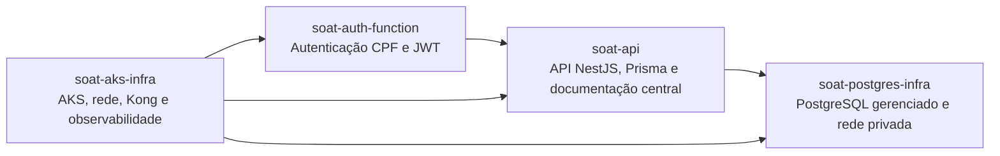

# Decisões de arquitetura - Fase 3

Este diretório preserva a trilha de decisão arquitetural da Fase 3 do Tech
Challenge. Ele separa dois artefatos com finalidades distintas:

- **RFC (Request for Comments):** registra contexto, alternativas e critérios
  que foram avaliados antes da escolha técnica;
- **ADR (Architecture Decision Record):** registra uma decisão que passa a
  orientar a implementação e suas consequências.

Os documentos descrevem a arquitetura-alvo. A existência de uma decisão não
significa que o recurso correspondente já esteja provisionado na nuvem.

## Mapa de responsabilidades dos repositórios

O diagrama descreve responsabilidades e integrações alvo. O provisionamento
dos recursos Azure permanece fora da Fase 2.

## RFCs

| RFC | Tema | Situação |
|---|---|---|
| [RFC-001](rfcs/RFC-001-plataforma-cloud.md) | Plataforma cloud | Aceito |
| [RFC-002](rfcs/RFC-002-banco-gerenciado.md) | Banco de dados gerenciado | Aceito com restrição de custo |
| [RFC-003](rfcs/RFC-003-autenticacao-cpf.md) | Autenticação de cliente por CPF | Aceito |

## ADRs

| ADR | Decisão | Situação |
|---|---|---|
| [ADR-001](adrs/ADR-001-azure-e-terraform.md) | Azure, grupos de recursos e Terraform | Aceito |
| [ADR-002](adrs/ADR-002-kong-api-gateway.md) | Kong como API Gateway | Aceito |
| [ADR-003](adrs/ADR-003-postgresql-gerenciado.md) | PostgreSQL gerenciado e modelo relacional | Aceito com restrição de custo |
| [ADR-004](adrs/ADR-004-jwt-por-cpf.md) | JWT de cliente emitido por Function | Aceito |
| [ADR-005](adrs/ADR-005-historico-status-os.md) | Histórico append-only de status da OS | Aceito |
| [ADR-006](adrs/ADR-006-isolamento-de-ambientes.md) | Isolamento de homologação e produção | Aceito |
| [ADR-007](adrs/ADR-007-hpa-e-disponibilidade.md) | HPA e disponibilidade da API | Aceito |

## Premissas de custo e segurança

A assinatura utilizada é uma Azure Free Account com crédito promocional. Não é
permitido convertê-la para Paga Pelo Uso nem assumir cobrança no cartão. Antes
de criar recursos de computação, banco ou observabilidade, o `terraform plan`
e a página de preços devem ser revisados para confirmar que o recurso cabe no
crédito remanescente. A destruição dos recursos temporários após a coleta das
evidências faz parte do plano de entrega.
