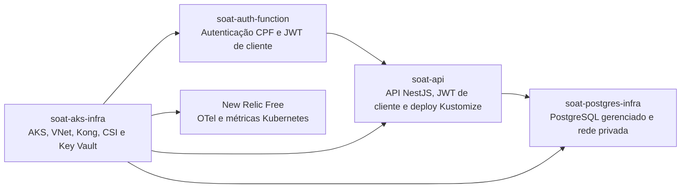
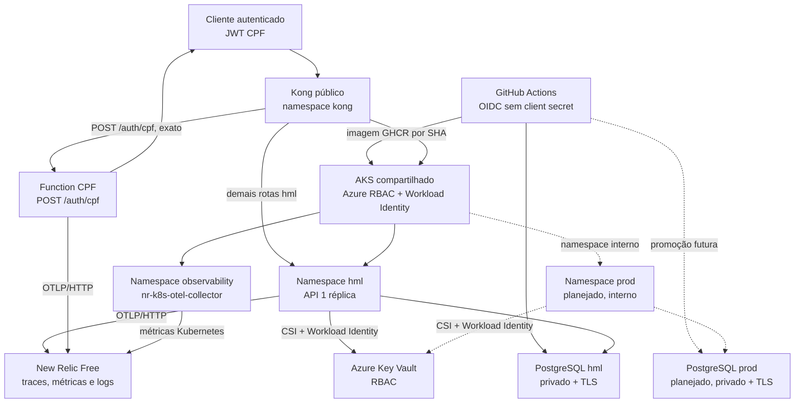
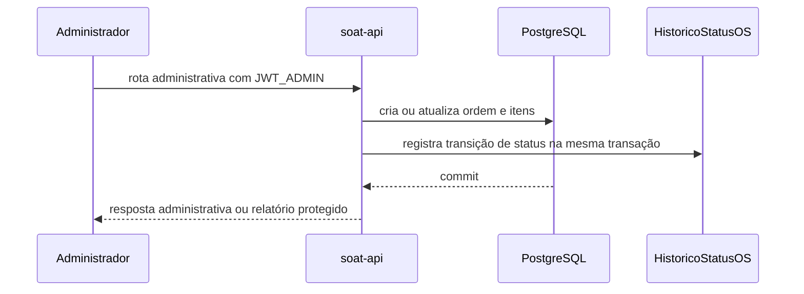

# Decisões de arquitetura - Fases 3 a 7

Este diretório preserva a trilha de decisão arquitetural da Fase 3 do Tech
Challenge. Ele separa dois artefatos com finalidades distintas:

- **RFC (Request for Comments):** registra contexto, alternativas e critérios
  que foram avaliados antes da escolha técnica;
- **ADR (Architecture Decision Record):** registra uma decisão que passa a
  orientar a implementação e suas consequências.

Os RFCs registram alternativas avaliadas; os ADRs registram decisões tomadas.
O estado operacional abaixo distingue explicitamente o que está comprovado em
homologação do que permanece interno em produção.

## Mapa de responsabilidades dos repositórios



## Topologia operacional comprovada em homologação



Em HML estão comprovados: Function de CPF, rota exata `/auth/cpf` no Kong,
API NestJS por imagem GHCR identificada pelo SHA do commit, PostgreSQL privado,
Key Vault, traces, logs, métricas, coletor Kubernetes, dashboard e monitores
de saúde. As travas de `apply` foram restauradas para desligadas após os
deploys controlados.

Produção tem namespace, banco e fluxo de promoção documentados como alvo, mas
não é tratada aqui como evidência operacional: não há Deployment da API nem
gateway público comprovados. HPA, PDB e ao menos duas réplicas serão aplicados
junto do Deployment produtivo; não são evidência operacional de HML.

A observabilidade da Fase 6 usa OpenTelemetry e New Relic Free. O coletor
`nr-k8s-otel-collector` cobre nós, CPU, memória, pods, eventos e
`kube-state-metrics`; API e Function enviam traces, logs e métricas de negócio
por OTLP/HTTP. A coleta de logs de containers permanece desabilitada para
evitar duplicidade. Não são usados Prometheus, Grafana, Azure Monitor ou
mudanças no `soat-postgres-infra` nesta fase.

O nó atual do AKS usa SKU `Standard_D2as_v6`, com autoscaling entre um e dois
nós. O cluster continua em tier Free, com Azure CNI Overlay, OIDC issuer,
Workload Identity e Azure RBAC.

## Sequências principais

### Autenticação CPF e consumo pelo cliente

```mermaid
sequenceDiagram
    participant C as Cliente
    participant K as Kong HML
    participant F as Function CPF
    participant DB as PostgreSQL HML
    participant A as soat-api

    C->>K: POST /auth/cpf (CPF)
    K->>F: encaminha rota exata e aplica rate limit
    F->>F: valida formato e dígitos verificadores
    F->>DB: consulta cliente ativo
    DB-->>F: cliente autorizado
    F-->>C: JWT cliente (sub=clienteId, role=cliente)
    C->>K: GET /cliente/ordens-servico/:id (Bearer JWT cliente)
    K->>A: encaminha para Service HML
    A->>DB: busca OS e compara clienteId com sub
    DB-->>A: OS do próprio cliente
    A-->>C: 200; OS de terceiro retorna 403
```

### Fluxo administrativo de ordem de serviço



O JWT administrativo (`JWT_ADMIN`) e o JWT de cliente (`JWT_CLIENTE`) têm
segredos, issuer/audience e guards separados. O webhook assinado de e-mail é
um fluxo distinto e não representa autenticação de cliente.

## RFCs

| RFC | Tema | Situação |
|---|---|---|
| [RFC-001](rfcs/RFC-001-plataforma-cloud.md) | Plataforma cloud | Aceito |
| [RFC-002](rfcs/RFC-002-banco-gerenciado.md) | Banco de dados gerenciado | Aceito com restrição de custo |
| [RFC-003](rfcs/RFC-003-autenticacao-cpf.md) | Autenticação de cliente por CPF | Aceito |

## ADRs

| ADR | Decisão | Situação |
|---|---|---|
| [ADR-001](adrs/ADR-001-azure-e-terraform.md) | Azure, grupos de recursos e Terraform | Aceito |
| [ADR-002](adrs/ADR-002-kong-api-gateway.md) | Kong como API Gateway | Aceito |
| [ADR-003](adrs/ADR-003-postgresql-gerenciado.md) | PostgreSQL gerenciado e modelo relacional | Aceito com restrição de custo |
| [ADR-004](adrs/ADR-004-jwt-por-cpf.md) | JWT de cliente emitido por Function | Aceito |
| [ADR-005](adrs/ADR-005-historico-status-os.md) | Histórico append-only de status da OS | Aceito |
| [ADR-006](adrs/ADR-006-isolamento-de-ambientes.md) | Isolamento de homologação e produção | Aceito |
| [ADR-007](adrs/ADR-007-hpa-e-disponibilidade.md) | HPA e disponibilidade da API | Aceito |

## Modelo de dados

O [modelo ER e a justificativa formal do PostgreSQL](modelo-er-postgresql.md)
derivam diretamente de `prisma/schema.prisma`. A escolha do banco está ligada
ao [RFC-002](rfcs/RFC-002-banco-gerenciado.md) e à
[ADR-003](adrs/ADR-003-postgresql-gerenciado.md).

## Premissas de custo e segurança

A assinatura utilizada é uma Azure Free Account com crédito promocional. Não é
permitido convertê-la para Paga Pelo Uso nem assumir cobrança no cartão. Antes
de criar recursos de computação, banco ou observabilidade, o `terraform plan`
e a página de preços devem ser revisados para confirmar que o recurso cabe no
crédito remanescente. A destruição dos recursos temporários após a coleta das
evidências faz parte do plano de entrega.
