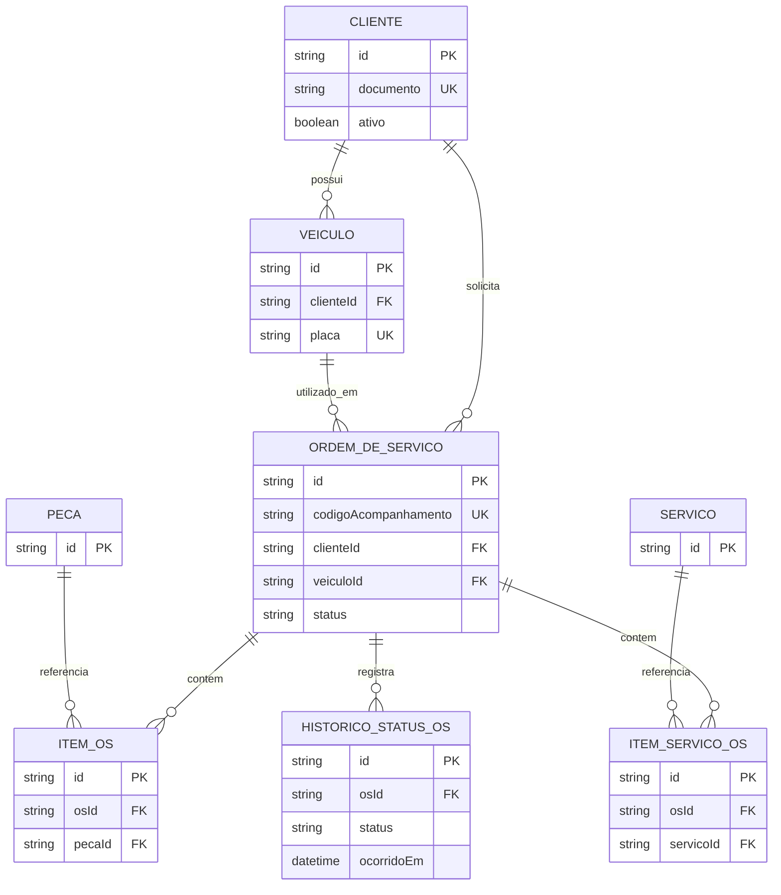

# Modelo ER e justificativa do PostgreSQL

## Modelo entidade-relacionamento

## Integridade e acesso

- As FKs `Veiculo.clienteId`, `OrdemDeServico.clienteId`,
  `OrdemDeServico.veiculoId`, `ItemOS.osId`, `ItemOS.pecaId`,
  `ItemServicoOS.osId`, `ItemServicoOS.servicoId` e
  `HistoricoStatusOS.osId` usam deleção restritiva.
- `Cliente.documento`, `Veiculo.placa` e
  `OrdemDeServico.codigoAcompanhamento` são únicos. O documento é normalizado
  na camada de domínio antes da persistência.
- Há índices para veículo por cliente, OS por cliente/status/veículo, itens
  por OS e catálogo, e histórico por `(osId, ocorridoEm)` e `status`.
- `HistoricoStatusOS` é append-only: a criação grava `RECEBIDA`; uma atualização
  grava novo evento somente se o status mudar. A ordem, itens e histórico são
  persistidos na mesma transação Prisma.

## Justificativa formal

PostgreSQL foi escolhido por combinar relações transacionais, integridade
referencial e consultas analíticas necessárias à oficina. O domínio exige que
cliente, veículo, catálogo, itens e ordem sejam consistentes em uma única
transação, enquanto o histórico de status precisa preservar a sequência de
eventos para relatórios de tempo médio por etapa. FKs restritivas impedem que
um item ou uma OS permaneça apontando para entidade removida; índices e
unicidades suportam os fluxos de consulta, autorização por `clienteId` e
acompanhamento.

Em Azure, o Flexible Server mantém TLS obrigatório, rede privada, DNS privado,
backup de sete dias e bancos separados por ambiente. A decisão é documentada
no [RFC-002](rfcs/RFC-002-banco-gerenciado.md) e formalizada na
[ADR-003](adrs/ADR-003-postgresql-gerenciado.md); este documento não introduz
outro banco nem replica de leitura fora do escopo.
